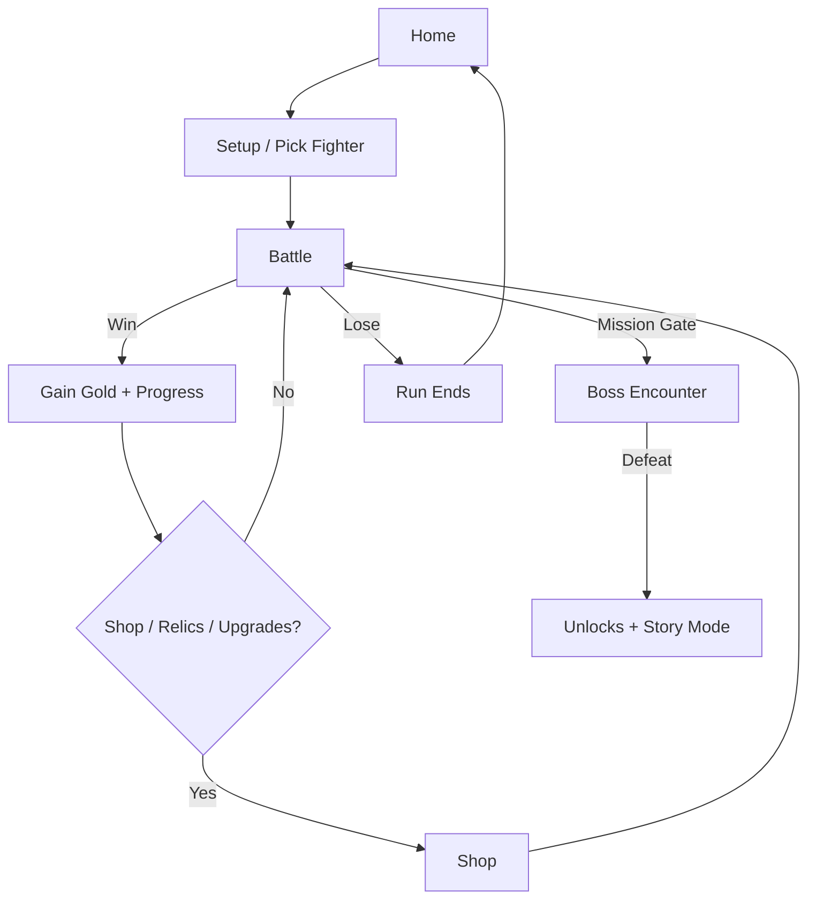

<!--
╔══════════════════════════════════════════════════════════════════════════════╗
║  🌌 COSMIC CARD WARS — README                                                ║
║  Tip: This file uses a few “cool effects” (animated SVG headers + details).  ║
╚══════════════════════════════════════════════════════════════════════════════╝
-->

<p align="center">
  
</p>

<p align="center">
  
  
  
</p>

<p align="center">
  <b>Endless enemies.</b> Your <b>Life</b> and <b>Armor</b> carry over between stages.
  Earn gold, buy relics, unlock cards, and step through the portal into Story Mode.
</p>

---

## ✨ Gameplay at a glance

- **Pick a fighter** and survive a chained gauntlet of enemies (your stats carry through the run).
- **Turn-based combat**: Attack, Ability, Potion, End Turn — then the enemy responds.
- **Armor vs Life**: Armor absorbs hits first; some skills deal **TRUE damage** that ignores armor.
- **Progression systems**: Gold economy, Shop, Card Upgrades, Missions, Rank/XP, Cosmetics, Lucky Draw, Redeem Codes.
- **Story Mode**: cinematic pages + boss fight (Omni) when unlocked.

---

## 🕹️ Controls / Actions

Inside battle you can typically:

- **Attack** (basic damage)
- **Use Ability** (often with cooldown)
- **Use Potion** (global potion cooldown)
- **End Turn**

> Tip: Check the “i” info icons for ability descriptions (printed in the battle log).

---

## 🚀 Quick Start (Local)

This project is a pure front-end game — no build step required.

1. Download/clone this repo
2. Open `index.html` in your browser  
   - Recommended: use a simple local server (optional)

### Optional: run with a local server

**VS Code**: install “Live Server”, then right-click `index.html` → **Open with Live Server**.

Or with Python:

```bash
# Python 3
python -m http.server 8000
# then open http://localhost:8000
```

---

## 🧠 Features

### ⚔️ Core Combat
- Turn-based duels with readable combat log and status effects (freeze / stun / etc.)
- Enemy AI variety (e.g., aggressive styles)
- Damage rules include physical vs TRUE damage (armor interactions)

### 🛒 Shop & Economy
- Earn **Gold** and spend it on:
  - **Relics**
  - **Upcoming Cards**
  - **Potions**
  - **Lucky Draw** (gacha)

### ⬆️ Card Upgrades
- Upgrade owned cards up to **Lv 5**
- Upgrades grant cumulative stat bonuses and scale with gold costs
- Modern modal UI for upgrades (mobile-friendly)

### 🎯 Missions & Unlock Gates
A guided progression where missions unlock bosses and rewards. Some cards are:
- **Enemy-only** until you meet specific conditions
- **Hidden** until unlocked (prevents spoilers in Gallery and random spawns)

### 🏅 Rank / XP / Cosmetics
- Profile progression: XP, wins/losses, high stage
- Rank-up overlay and cosmetic unlock hints
- Avatars + frames (cosmetic UI)

### 🎰 Lucky Draw (Gacha)
- Single and 5x pulls
- Rare/legendary bursts, confetti, and “jackpot” vibes
- Rewards include gold and special card unlocks (depending on config)

### 🎁 Redeem Codes
- Offline (local-only) redeem system
- Prevents code re-use and supports alias codes

---

## 🗺️ Game Loop Diagram (Mermaid)



---

## 📂 Project Structure

```text
.
├── index.html      # UI screens (Home, Setup, Battle, Story, Gallery, Shop)
├── styles.css      # UI styling, rank effects, overlays, animations
└── game.js         # Game logic (combat, shop, missions, story, saves)
```

---

## 🧪 Dev Notes (for future improvements)

- Add a **Screenshots** folder and embed images/gifs here:
  - `./assets/screenshot-home.png`
  - `./assets/screenshot-battle.png`
- Consider adding:
  - A “seeded run” mode for reproducible fights
  - More enemy AI personalities
  - A small “balance config” section (e.g., JSON) for easier tuning

---

## 📸 Screenshots (placeholder)

> Add your screenshots to `assets/` and update the links below.

```md


```

---

## 🧾 License

Choose one:
- MIT (recommended for open-source)
- Apache-2.0
- GPL-3.0

> If you want, I can generate a `LICENSE` file too.

---

## ⭐ Support

If you like the project:
- Give it a ⭐ on GitHub
- Share a clip of your highest stage run

<p align="center">
  
</p>
